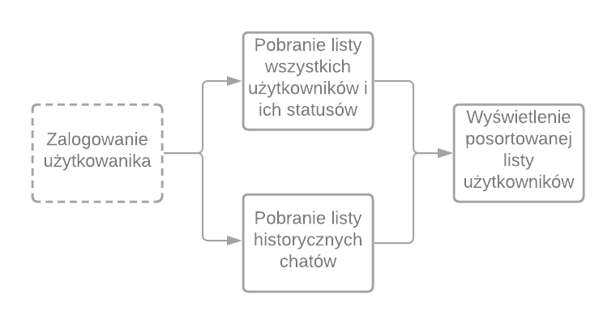

## Język skryptowy

Python - [dokumentacja](https://docs.python.org/3/tutorial/index.html)

## Podsumowanie wymagań z poprzednich list

W chwili obecnej system posiada następujące możliwości:
- Wysyłanie wiadomoości do wybranego użytkownika
- Odbieranie wiadomości od wybranego użytkownika
- Wyświetlenie konwersacji z wybranym użytkownikiem
- Wyświetlenie listy dostępnych użytkowników
- Możliwośc wysłania wiadomości "do wszystkich" na czacie ogólnym
- Możliwość dodania użytkownika (rejestracja)
- Możliwość zalogowania użytkownika
- Podział aplikacji na klient-serwer
- Serwer obsługuje wielu klientów na raz
- Zapisywanie wysłanych wiadomości do bazy danych serwera
- Zapisywanie użytkowników w bazie danych serwera

## Zadanie (max. 20 ptk.)

1. (1 ptk.) Każdy użytkownik posiada status aktywności (zalogowany/nie zalogowany lub dostępny/niedostępny)

2. (1 ptk.) Każda z wiadomości posiada:
    - datę i czas wysłania
    - status odczytania (aktualizowaną kiedy użytkownik wyświetli wiadomość)

3. (2 ptk.) API pozwala:
    - pobrać liczbę nieprzeczytanych wiadomości od użytkownika
    - oznaczyć pojedynczą wiadomość jako przeczytaną

4. (2 ptk.) Po zalogowaniu użytkownik widzi posortowaną listę użytkowników w kolejności:
    - czas od ostatnio wysłanej wiadomości (jeżeli była konwersacja) [od najmłodszych]
    - status użytkownik [od aktywnych]

5. (3 ptk.) Lista użytkowników jest też listą konwersacji
    - obok nazwy użytkownika wyświetla się liczba nieprzeczytanych wiadomości
    - obok nazwy użytkownika wyświetla się jego status (aktywny/nieaktywny)
    - po wybraniu użytkownika z listy otwiera się okno konwersacji
        - jeżeli w istnieją historyczne wiadomości to powinny one zostać pobrane i wyświetlone w oknie chatu

6. (3 ptk.) Po zalogowaniu klient nawiązuje połączenie za pomocą websocket z serwerem i reaguje na nie asynchronicznie (nie blokując UI)

7. (5 ptk.) Serwer wysyła (a klient reaguje na) następujące informacje w czasie rzeczywistym (za pomocą websocket):
    - serwer: zarejestrował się nowy użytkownik -> klient: odświeża listę wszystkich użytkowników
    - serwer: zalogował się użytkownik -> klient: odświeża statusy użytkowników i sortuje listę konwersacji ponownie
    - serwer: wylogował się użytkownik -> klient: odświeża statusy użytkowników i sortuje listę konwersacji ponownie
    - serwer: użytkownik dostał wiadomość -> klient: odświeża konwersację jeżeli aktywna, jeżeli nie aktualizuje liczbę nieprzeczytanych wiadomości
    - serwer: użytkownik odczytał wiadomość -> klient: odświeża status wiadomości

8. (1 ptk.) Po odebraniu wiadomości jeżeli wyświetliła się ona w oknie konwersacji, klient powiadamia serwer o jej przeczytaniu.

9. (2 ptk.) UI klienta przypomina konwersację (jak obraz poniżej)
    - Każda wiadomość posiada widoczny status przeczytania
    - Każda wiadomość posiada informacje o dacie i godzinie wysłania
    - Każda wiadomość posiada informacje od kogo została przesłana + podział prawo-lewo jako nadawca-odbiorca
    - Wiadomości wysłane odróżniają się wizualnie od odebranych

    

## Najważniejsze wymagania

- Dostosować serwer oraz klientów do przekazywania informacji wymaganych w zadaniu
- Dodać możliwość powiadamiania klienta w czasie rzeczywistym o otrzymanych wiadomościach
- Zaimplementować najważniejsze procesy w aplikacji

## Najważniejsze procesy w aplikacji

- Logowanie użytkownika

    

- Rozpoczęcie konwersacji

    

## Dodatkowa dokumentacja

- Komunikacja w czasie rzeczywistym (serwer -> klient) wymaga zastosowania odpowieniego portokołu, np websocket. Więcej informacji można znaleźć pod linkiem: [websockets.readthedocs.io/en/stable/intro.html](https://websockets.readthedocs.io/en/stable/intro.html)