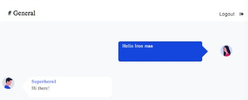

## Język skryptowy

Python - [dokumentacja](https://docs.python.org/3/tutorial/index.html)

## Zadanie (max. 10 ptk.)

Napisz prostą aplikację klient – serwer umożliwiającą komunikację tekstową pomiędzy klientami za pośrednictwem serwera.

### Wymagania

1. (1 ptk.) Program serwera musi posiadać api umożliwiające wysyłanie wiadomości do wybranego klienta (na podstawie identyfikatora)

2. (1 ptk.) Program serwera musi posiadać api umożliwiające odbieranie wiadomości dla zalogowanego klienta.

3. (1 ptk.) Wiadomości wysłane powinny być przechowywane w pamięci serwera i usuwane po odebraniu ich przez aplikacje kliencką.

4. (1 ptk.) Klienci (więcej niż 1 na raz) muszą mieć możliwość nawiązania komunikacji z serwerem poprzez zalogowanie się identyfikatorem (hasło nie jest potrzebne, ale identyfikator musi być unikatowy)

5. (2 ptk.) Aplikacje klienckie powinny posiadać prosty interfejs GUI umożliwiający na zdefiniowanie identyfikatora potrzebnego do zalogowania oraz podgląd wiadomości wysłanych i odebranych w formie chatu.

   

6. (2 ptk.) Aplikacja serwera nie powinna posiadać GUI, ale powinna posiadać api udokumentowane zgodnie ze standardem OpenApi 2.0+ (Swagger). Zalecam użycie odpowiednej biblioteki do wygenerowania dokumentacji np: [safrs](https://github.com/thomaxxl/safrs).

   

7. (2 ptk.) Kod klienta powinien być wygenerowany automatycznie przy zastosowaniu narzędzi automatyzujących proces integracji z API np: [openapi-generator](https://github.com/OpenAPITools/openapi-generator). Zalecam sprawdzenie pakietu @openapitools/openapi-generator-cli na npmjs.com i ewentualne użyciue komendy `npx @openapitools/openapi-generator-cli`

## Publikowanie rozwiązań

Rozwiązania umieść w folderze `Lab 8/Solutions` i opublikuj w formie **_Pull Request_** do tego repozytorium do gałęzi odpowiadającej Twojemu numerowi identyfikacyjnemu.
